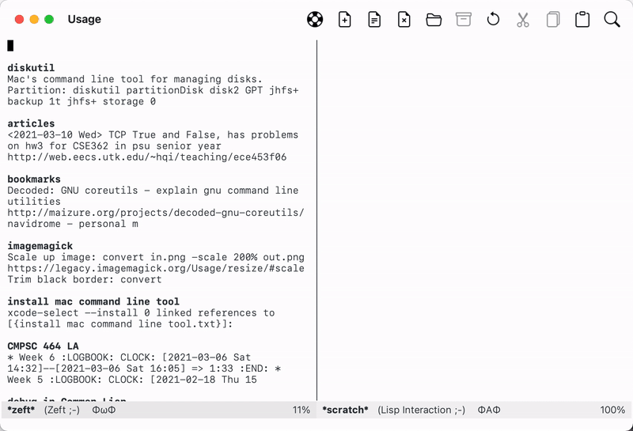

# What is Xeft

1. A dynamic module that exposes a very basic indexing feature to
   Emacs Lisp, that lets you index and search a text files very fast.

```emacs-lisp
;; Querying my ~40MB worth of notes.
(benchmark-run 100 (xeft-query-term "common lisp" xeft-database 0 10))
;;=> (0.031512 0 0.0)
```

2. A note taking interface like Deft, built on top of the dynamic module.

# Usage

To use Xeft the note searching interface, install it and type `M-x
xeft RET` to bring up the panel. If the dynamic module isn’t compiled,
you are prompted to compile it. Refer to the next section for
prerequisites for compiling the module.

Once the xeft buffer is up, type the search phrase in the first line.
Press `C-n` and `C-p` to go through each file. You can preview a file
in another window by pressing `SPC` on a file, or click the file with
the mouse. Press `RET` to open the file in the current window.

Directory `xeft-directory` stores note files, directory
`xeft-database` stores the database. Xeft uses
`xeft-default-extension` to create new files, and it ignores files
with `xeft-ignore-extension`.

By default, Xeft only searches for first level files in
`xeft-directory`, to make it search recursively, set `xeft-recursiv`
to t.

See the “xeft” customize group for more custom options and faces.

# building the dynamic module

To build the module, you need to have Xapian installed. On Mac, it can
be installed with macports by

```shell
sudo port install xapian-core
```

Then, build the module by

```shell
make PREFIX=/opt/local
```

Here `/opt/local` is the default prefix of macports, which is what I
used to install Xapian. Homebrew and Linux users probably can leave it
empty.

# Beware

Since its a dynamic module, if Xeft goes wrong, it will crash Emacs.

# notdeft

Many thanks to the author of notdeft. I don’t really know C++ or
Xapian, without reading his code I wouldn’t be able to write Xeft.

Also, if you want a more powerful searching experience, you will be
happier using notdeft instead.

# How to use the dynamic module

Because it’s so basic, the dynamic module is very easy to use and
also very flexible. To index files, use

```emacs-lisp
(dolist (file (directory-files "my-note-dir"))
  (xeft-reindex-file file dbpath))
```

This indexes each file in `my-note-dir`, saving them to the database
at `dbpath`. If the database doesn’t exist yet, it is created.

To search for a term, use

```emacs-lisp
(xeft-query-term "search term" dbpath 0 10)
```

This returns a list of paths of the files that contains `search term`,
ranked by relevance. The `0` and `10` means “return 10 results
starting from the 0th place”, it is essentially used for paging. If
you want all the result, use `0` and `999999`.

When a file is modified, call `xeft-reindex-file` again on that file.
If a file is removed, you don’t need to remove it from the database,
it will be automatically removed. If the file has been indexed and
haven’t been modified, `xeft-reindex-file` is (kind of) a no-op (i.e.
fast).

Both file path and database path must be absolute path.
